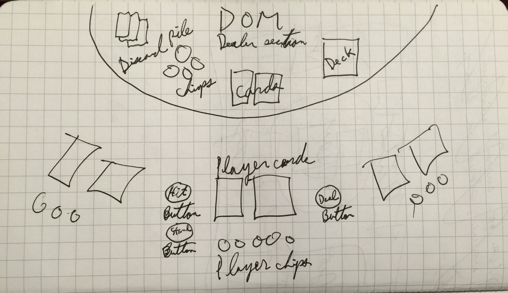
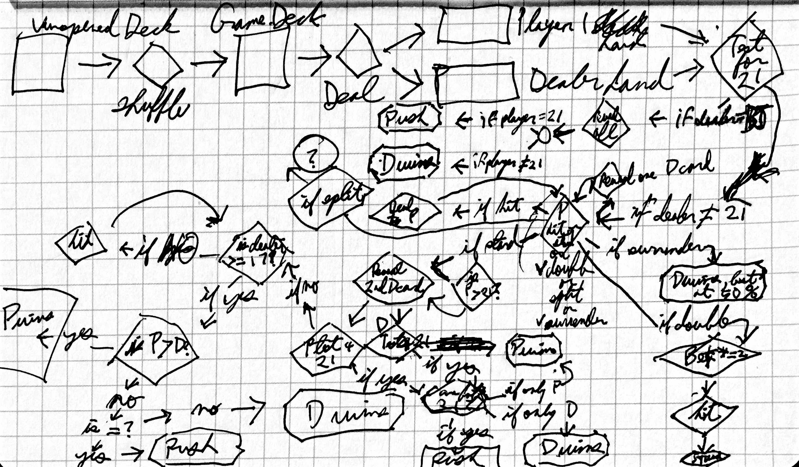

## Introduction

Please note: I moved this project into the github.io folder at the end of construction - to see the full revision history, please see the project repo "blackjack" folder itself.

## Technologies used:
* Javascript
* jQuery
* HTML
* CSS
* Twitter Bootstrap

## the approach taken

## installation instructions(which may just be a link to your hosted game)

## wireframe images

## user stories

## To-Do list:
* uncomment name prompt in Game.player object.
* add settimeouts so that hitting, etc. isn't instantaneous.
* switch local jquery and bootstrap links with CDN links
* add additional decks of cards

## Outstanding bug list:

1. Every time a player gets blackjack, the game hangs. 
2. Recognition of Aces as either 1 or 11 is still iffy. For instance, an ace dealt on the dealer side is counted as a 1 properly, but an ace on the player side is counted as an 11. 

## Fixed Bug List:
1. every now and then, I get a really weird error: Uncaught RangeError: Maximum call stack size exceeded(…) game.js:58. This seems to happen whenever I do a recursive function call. SOLUTION: don't use recursion as the default in a switch statment.
2. .slice() keeps creating a new nested array every time it is used. This is making things very complicated. SOLUTION: slice returns an array, so use .slice()[0] instead.
3. The function to empty the player hand and dealer hand isn't removing the first card. SOLUTION: set pop() loop to decrement, not increment.
4. Intermittently, "hit" dispenses two cards at once. Seems to often be after a bust. SOLUTION: isolate event listeners so they don't get run concurrently more than once. 
5. Game doesn't correctly recognize Aces as optionally 11 points. SOLUTION: implemented "if" function that treates Aces as 11 if total + 11 <= 21.

## Wish list:
* Build animations
* make multiple player objects. Perhaps an array of players? Need constructor function.
* create constructor to generate a deck rather than using a giant object?
* move a bunch of Player/Dealer functions (hit, bust, score, blackjack, etc) into a constructor?
* add "split" functionality